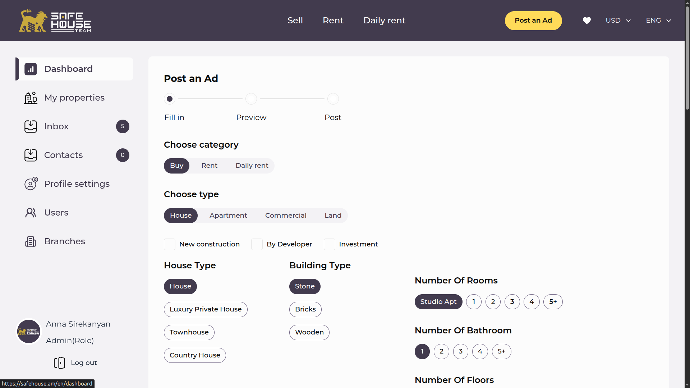
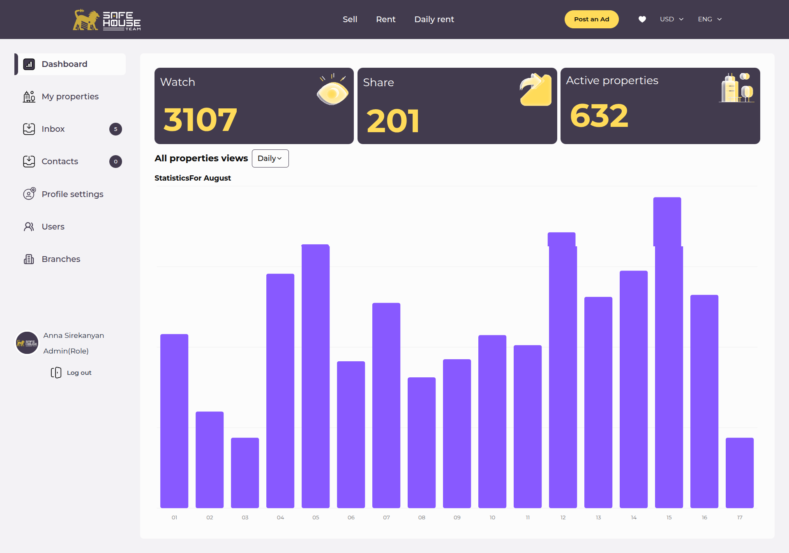
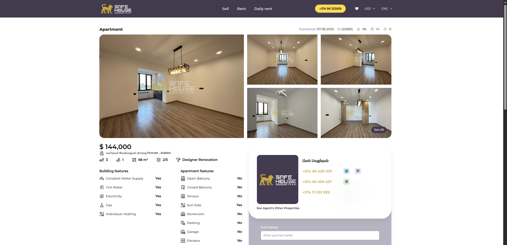
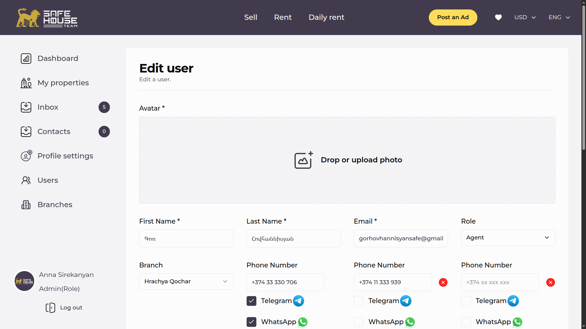
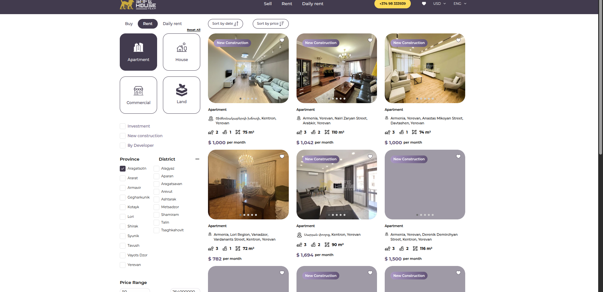
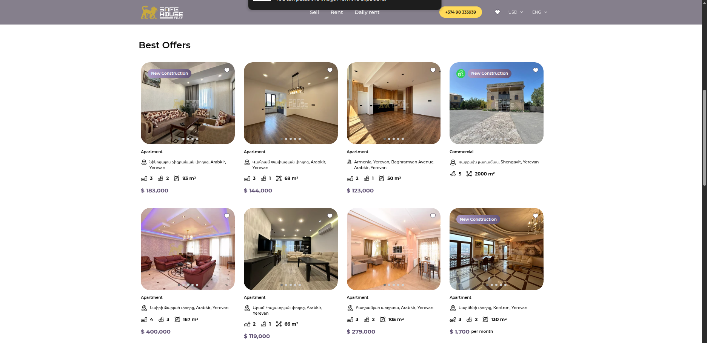
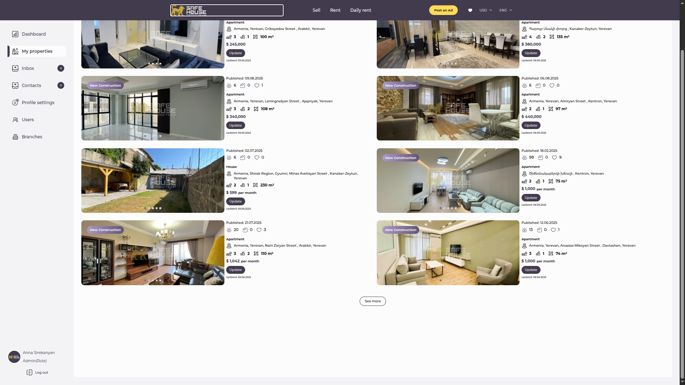
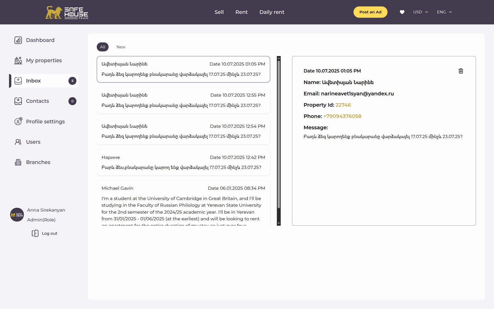
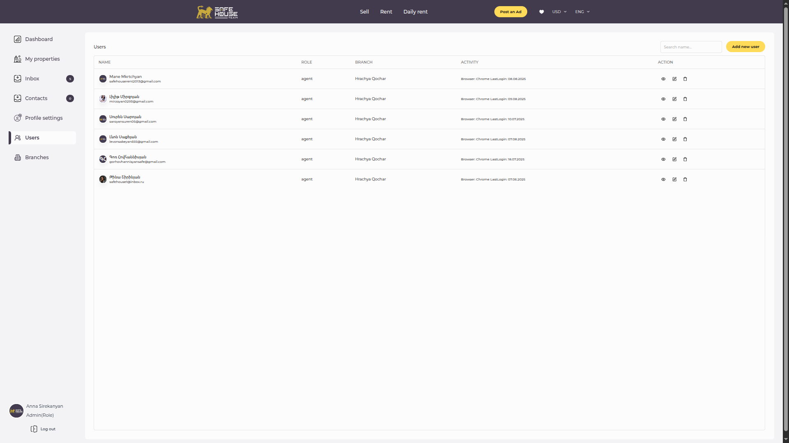
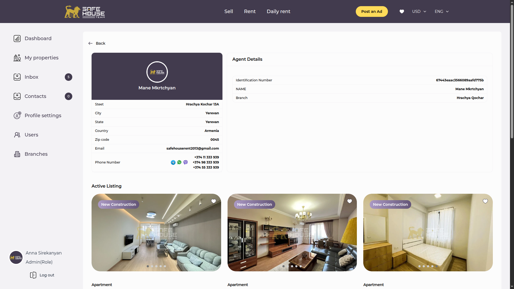

# Safe House - Real Estate Platform

Safe House is a modern, feature-rich real estate platform built with Next.js and TypeScript. It allows users to browse, search, and manage property listings.

**Live Demo:** [https://safehouse.am/en](https://safehouse.am/en)

---

***Note:** This is a commercial project. The source code for the front-end is made public with the client's permission for demonstration purposes. The back-end repository is private. Therefore, this repository is for viewing only and cannot be run locally without access to the private back-end services.*

## Features

*   **Property Listings:** View and manage property listings with detailed information.
*   **Advanced Search:** Filter properties based on various criteria like price, location, and amenities.
*   **User Authentication:** Secure user registration and login functionality.
*   **Dashboard:** A user-friendly dashboard for managing properties and user profiles.
*   **Internationalization:** Support for multiple languages.
*   **Responsive Design:** A fully responsive layout that works on all devices.

## Tech Stack

*   **Framework:** [Next.js](https://nextjs.org/)
*   **Language:** [TypeScript](https://www.typescriptlang.org/)
*   **Styling:** [Tailwind CSS](https://tailwindcss.com/)
*   **UI Components:** [Shadcn UI](https://ui.shadcn.com/)
*   **Authentication:** [NextAuth.js](https://next-auth.js.org/)

## Getting Started

To get a local copy up and running, follow these simple steps.

### Prerequisites

*   [Node.js](https://nodejs.org/) (v18.x or later)
*   [Bun](https://bun.sh/)

## Screenshots

| Add Property | Dashboard |
| :---: | :---: |
|  |  |

| Details Page | Edit User |
| :---: | :---: |
|  |  |

| Filter Page | Home Page |
| :---: | :---: |
|  |  |

| House List | Inbox |
| :---: | :---: |
|  |  |

| User List | User Profile |
| :---: | :---: |
|  |  |

